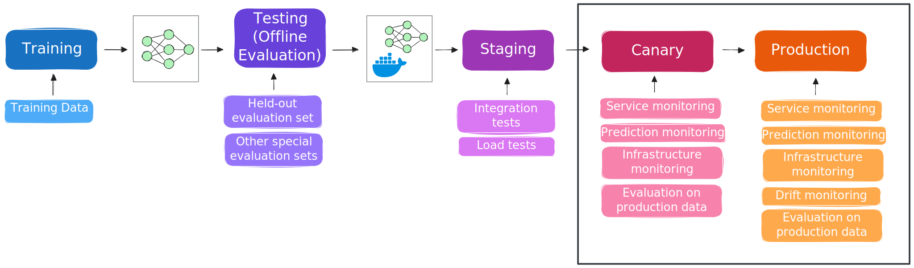
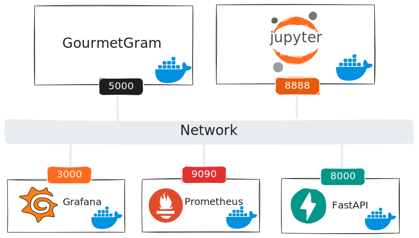

# Online evaluation of ML systems

In this tutorial, we will practice selected techniques for evaluating machine learning systems, and then monitoring them in production. We will:

The lifecycle of a model may look something like this:

* **Training**: Initially, a model is trained on some training data
* **Testing** (offline): If training completes successfully, the model progresses to a testing - offline evaluation - stage. In this stage, it is evaluated using a held-out evaluation set not used in training, and potentially other special evaluation sets (as we'll see in this tutorial).
* **Staging**: Given satisfactory performance on the online evaluation, the model may be *packaged* as part of a service, and then this package promoted to a staging environment that mimics the "production" service but without live users. In this staging environmenmt, we can perform integration tests against the service and also load tests to evaluate the inference performance of the system.
* **Canary** (or blue/green, or other "preliminary" live environment): From the staging environment, the service can be promoted to a canary or other preliminary environment, where it gets requests from a small fraction of live users. In this environment, we are closely monitoring the service, its predictions, and the infrastructure for any signs of problems. We will try to "close the feedback loop" so that we can evaluate how effective our model is on production data, and potentially, evaluate the system on business metrics.
* **Production**: Finally, after a thorough offline and online evaluation, we may promote the model to the live production environment, where it serves most users. We will continue monitoring the system for signs of degradation or poor performance.

In this particular section, we will practice evaluation and monitoring in the *online* stage - when a system is serving some or all real users. 

It's only part of the online evaluation, though - in this section, we have not yet "closed the feedback loop". We'll do that in another section.



To run this experiment, you should have already created an account on Chameleon, and become part of a project. You should also have added your SSH key to the KVM@TACC site.


## Experiment resources 

For this experiment, we will provision one virtual machine on KVM@TACC.

Our initial online system, with monitoring of the live service, will include the following components:

* a FastAPI endpoint for our model
* a Flask app that sends requests to our FastAPI endpoint

These comprise the operational system we want to evaluate and monitor! To this, we'll add:

* Prometheus, an open source systems monitoring and alerting platform
* and Grafana, a dashboard platform that lets us visualize metrics collected by Prometheus

These will help us monitor operational metrics, like response time or number of requests per second.




## Open this experiment on Trovi


At the beginning of your GPU lease time, you will continue with the next step, in which you bring up and configure a VM instance! To begin this step, open this experiment on Trovi:

* Use this link: [Online evaluation of ML systems](https://chameleoncloud.org/experiment/share/) on Trovi
* Then, click “Launch on Chameleon”. This will start a new Jupyter server for you, with the experiment materials already in it, including the notebok to bring up the bare metal server.


## Launch and set up a VM instance- with python-chi

We will use the `python-chi` Python API to Chameleon to provision our VM server. 

We will execute the cells in this notebook inside the Chameleon Jupyter environment.

Run the following cell, and make sure the correct project is selected. 


```python
from chi import server, context
import chi, os, time, datetime

context.version = "1.0" 
context.choose_project()
context.choose_site(default="KVM@TACC")
```


We will use bring up a `m1.medium` flavor server with the `CC-Ubuntu24.04` disk image. 

> **Note**: the following cell brings up a server only if you don't already have one with the same name! (Regardless of its error state.) If you have a server in ERROR state already, delete it first in the Horizon GUI before you run this cell.


```python
username = os.getenv('USER') # all exp resources will have this prefix
s = server.Server(
    f"node-eval-online-{username}", 
    image_name="CC-Ubuntu24.04",
    flavor_name="m1.medium"
)
s.submit(idempotent=True)
```


Then, we'll associate a floating IP with the instance:


```python
s.associate_floating_ip()
```

```python
s.refresh()
s.check_connectivity()
```


In the output below, make a note of the floating IP that has been assigned to your instance (in the "Addresses" row).


```python
s.refresh()
s.show(type="widget")
```


By default, all connections to VM resources are blocked, as a security measure.  We need to attach one or more "security groups" to our VM resource, to permit access over the Internet to specified ports.

The following security groups will be created (if they do not already exist in our project) and then added to our server:


```python
security_groups = [
  {'name': "allow-ssh", 'port': 22, 'description': "Enable SSH traffic on TCP port 22"},
  {'name': "allow-5000", 'port': 5000, 'description': "Enable TCP port 5000 (used by Flask)"},
  {'name': "allow-8000", 'port': 8000, 'description': "Enable TCP port 8000 (used by FastAPI)"},
  {'name': "allow-8888", 'port': 8888, 'description': "Enable TCP port 8888 (used by Jupyter)"},
  {'name': "allow-3000", 'port': 3000, 'description': "Enable TCP port 3000 (used by Grafana)"},
  {'name': "allow-9090", 'port': 9090, 'description': "Enable TCP port 9090 (used by Prometheus)"},
  {'name': "allow-8080", 'port': 8080, 'description': "Enable TCP port 8080 (used by cAdvisor, Label Studio)"}
]
```


```python
# configure openstacksdk for actions unsupported by python-chi
os_conn = chi.clients.connection()
nova_server = chi.nova().servers.get(s.id)

for sg in security_groups:

  if not os_conn.get_security_group(sg['name']):
      os_conn.create_security_group(sg['name'], sg['description'])
      os_conn.create_security_group_rule(sg['name'], port_range_min=sg['port'], port_range_max=sg['port'], protocol='tcp', remote_ip_prefix='0.0.0.0/0')

  nova_server.add_security_group(sg['name'])

print(f"updated security groups: {[group.name for group in nova_server.list_security_group()]}")
```


### Retrieve code and notebooks on the instance

Now, we can use `python-chi` to execute commands on the instance, to set it up. We'll start by retrieving the code and other materials on the instance.


```python
s.execute("git clone https://github.com/teaching-on-testbeds/eval-monitor-chi")
```


### Set up Docker

Here, we will set up the container framework.


```python
s.execute("curl -sSL https://get.docker.com/ | sudo sh")
s.execute("sudo groupadd -f docker; sudo usermod -aG docker $USER")
```


## Open an SSH session

Finally, open an SSH sesson on your server. From your local terminal, run

```
ssh -i ~/.ssh/id_rsa_chameleon cc@A.B.C.D
```

where

* in place of `~/.ssh/id_rsa_chameleon`, substitute the path to your own key that you had uploaded to CHI@TACC
* in place of `A.B.C.D`, use the floating IP address you just associated to your instance.


## Prepare data

For the rest of this tutorial, we'll be evaluating models on the [Food-11 dataset](https://www.epfl.ch/labs/mmspg/downloads/food-image-datasets/). We're going to prepare a Docker volume with this dataset already prepared on it, so that the containers we create later can attach to this volume and access the data. 


First, create the volume:

```bash
# runs on node-eval
docker volume create food11
```

Then, to populate it with data, run

```bash
# runs on node-eval
docker compose -f serve-model-chi/docker/docker-compose-data.yaml up -d
```

This will run a temporary container that downloads the Food-11 dataset, organizes it in the volume, and then stops. It may take a minute or two. You can verify with 

```bash
# runs on node-eval
docker ps
```

that it is done - when there are no running containers.

Finally, verify that the data looks as it should. Start a shell in a temporary container with this volume attached, and `ls` the contents of the volume:

```bash
# runs on eval
docker run --rm -it -v food11:/mnt alpine ls -l /mnt/Food-11/
```

it should show "evaluation", "validation", and "training" subfolders.


## Launch containers

Inside the SSH session, bring up the Flask, FastAPI, Prometheus, and Grafana services:


```bash
# runs on node-eval-online
docker compose -f eval-monitor-chi/docker/docker-compose-prometheus.yaml up -d
```

Run

```bash
# run on node-eval-online
docker logs jupyter
```

and look for a line like

```
http://127.0.0.1:8888/lab?token=XXXXXXXXXXXXXXXXXXXXXXXXXXXXXXXXXXXXXXXXXXXXXXXX
```

Paste this into a browser tab, but in place of 127.0.0.1, substitute the floating IP assigned to your instance, to open the Jupyter notebook interface that is running *on your compute instance*.

Then, in the file browser on the left side, open the "work" directory and then click on the `4-eval_online.ipynb` notebook to continue.


## Evaluate and monitor a model online

In addition to an offline evaluation, we also need to evaluate and monitor the ML system online, when it is "live" and accepting requests on "production data".

In this section, we will practice online evaluation of a model! After you finish this section, you should understand how to:

* monitor operational metrics in a live service
* monitor model predictions in a live service
* monitor drift in a live service

(In a separate experiment, we'll practice "closing the feedback loop," and try online evaluation of models with human feedback.)


```python
# runs in jupyter container on node-eval-online-online
import os, base64, time, random, requests
from concurrent.futures import ThreadPoolExecutor, as_completed
import torch
from torch.utils.data import DataLoader
from torchvision import datasets, transforms
import numpy as np
import matplotlib.pyplot as plt
import seaborn as sns
from PIL import Image

```


### Monitor operational metrics


To monitor a service using Prometheus, it needs to expose an HTTP endpoint (by convention, `/metrics`) that Prometheus can scrape. For standard frameworks like Flask or FastAPI (or Triton inference server, for that matter) it is easy to use existing libraries to quickly instrument a service. 

We have already started an updated FastAPI service, which looks very similar to one we've developed previously, but now:

* in `requirements.txt`, we've added the `prometheus-fastapi-instrumentator` library as a dependency
* and inside the app itself, we've added this to the beginning:

```python
from prometheus_fastapi_instrumentator import Instrumentator
```

* and this to the end:

```python
Instrumentator().instrument(app).expose(app)
```

Meanwhile, we have configured our Prometheus service to get metrics from this service every 15 seconds, in `prometheus.yml`:

```
global:
  scrape_interval: 15s

scrape_configs:
  - job_name: 'food11'
    static_configs:
      - targets: ['fastapi_server:8000']
```


That's all it takes to start sharing the basic operational metrics of a FastAPI service!


Now, if we visit

```
http://A.B.C.D:8000/docs
```

in a browser, but using the floating IP assigned to our instance in place of `A.B.C.D`, we'll note that in addition to a `/predict` endpoint, our FastAPI service now has a `/metrics` endpoint. This is the endpoint that will be scraped by Prometheus. 

Click on "/metrics", then "Try it out" and "Execute" to see what it returns.


Before we look at the actual metrics in Prometheus, let's generate some data from operational use. 

In a browser, we'll visit 

```
http://A.B.C.D:5000
```

but using the floating IP assigned to our instance in place of `A.B.C.D`. Then, upload a few images to the web app and submit them for classification.

Now (or, within 15 seconds!) we can look up some operational metrics related to those queries in Prometheus. 

In a browser, we'll visit 

```
http://A.B.C.D:9090
```

but using the floating IP assigned to our instance in place of `A.B.C.D`. This will open the Prometheus web UI.

First, let's find out about the services that this Prometheus instance is monitoring. From the menu, choose "Status" > "Targets" and note the FastAPI endpoint and its status.

Next, let's look at some of the metrics data. Prometheus uses a query language called PromQL to query metrics, but we can find some metrics of interest without knowing any PromQL. From the menu, choose "Graph". Then, click on the globe icon 🌎 near the query bar to see some of the available metrics we can query. Find "http_requests_total" in the list and click on it to select it, and click "Execute".

Prometheus will show us metrics related to all endpoints of the FastAPI service, but we are primarily interested in the metrics associated with the "/predict" endpoint. Copy the line

```
http_requests_total{handler="/predict", instance="fastapi_server:8000", job="food11", method="POST", status="2xx"}
```

and paste *that* into the query bar. Hit Execute. 

Switch from the "Table" tab to the "Graph" tab to see a visualization of the cumulative number of requests served by this endpoint. Revisit the GourmetGram app again, and upload a few more images for classification; then execute the query in Prometheus again (or, after 15 seconds!) and confirm that it is incremented accordingly.

Instead of getting the cumulative count of requests, we may prefer to see the rate of requests per second. Put

```
rate(http_requests_total{handler="/predict", instance="fastapi_server:8000", job="food11", method="POST", status="2xx"}[1m])
```

into the query bar and click "Execute" to see the rate of requests per second, averaged over a 1 minute moving window. You can use the + and - buttons to adjust the range of the horizontal axis to the time interval for which you have measurements.

To see more, let's generate some more requests. We'll send some requests directly from this notebook to the FastAPI service.


```python
# runs in jupyter container on node-eval-online-online
image_path = "test_image.jpeg"
with open(image_path, 'rb') as f:
    image_bytes = f.read()
encoded_str =  base64.b64encode(image_bytes).decode("utf-8")
```

```python
# runs in jupyter container on node-eval-online
FASTAPI_URL = "http://fastapi_server:8000/predict"
payload = {"image": encoded_str}
num_requests = 100

for _ in range(num_requests):
    response = requests.post(FASTAPI_URL, json=payload)
```


Now that we have generated some data that we can query, let's use Prometheus to understand how long it takes our inference endpoint to serve requests. 

Request durations are reported as histograms, which is a slightly more involved metric type. Use the query:

```
rate(http_request_duration_seconds_sum{handler="/predict", job="food11"}[1m]) / 
rate(http_request_duration_seconds_count{handler="/predict", job="food11"}[1m])
```

to see the average duration of HTTP requests averaged over a 1 minute window.

Averages can be skewed, though - so let's also look at the median, using the query:

```
histogram_quantile(0.5, rate(http_request_duration_seconds_bucket{handler="/predict", job="food11"}[1m]))
```


or, to get a sense of the worst-case user experience, we can check the 95th percentile using the query:

```
histogram_quantile(0.5, rate(http_request_duration_seconds_bucket{handler="/predict", job="food11"}[1m]))
```


For ongoing monitoring, we can create a dashboard using Grafana.  In a browser, we'll visit 

```
http://A.B.C.D:3000
```

but using the floating IP assigned to our instance in place of `A.B.C.D`. This will open the Grafana web UI.

Sign in using the username `admin` and password `admin`. You will be prompted to change the initial password.

Then, you'll configure it to connect to Prometheus: 

* From the menu, choose: "Connections" > "Data Sources". 
* Click "Add data source" and choose "Prometheus". 
* Set URL to http://prometheus:9090.
* Click "Save & Test"

Next, we're going to build a dashboard! 

* Click "Dashboards" > "Create dashboard" and "Add visualization".
* Select your Prometheus data source.
* Near the bottom, you will see the query builder for your Prometheus data source. Click the "Code" button to toggle from "builder mode" to "code (PromQL) mode". 
* Put the following query in the box and then click "Run queries":

```
1000 * rate(http_request_duration_seconds_sum{handler="/predict", job="food11"}[1m]) / 
rate(http_request_duration_seconds_count{handler="/predict", job="food11"}[1m])
```

* At the top of the graph, adjust the visible time range to 15 minutes, so that you can see the data
* On the right side, change the panel options: Set title to "Food11 average request duration (ms)"
* When you are satisfied with the appearance, click "Save dashboard" and give your dashboard the title "Food11 Service Monitoring"

Now, you can click on "Dashboards" > "Food11 Service Monitoring" to see your dashboard.

Let's add another panel, showing the median, 95th percentile, and 99th percentile request duration. 

* Open the dashboard, and click "Edit" in the top right. Then click "Add" > "Visualization".
* In the query editor, paste this query and "Run queries":

```
1000*histogram_quantile(0.5, rate(http_request_duration_seconds_bucket{handler="/predict"}[1m]))
```

* Then, click "Add query" and repeat for this query:

```
1000*histogram_quantile(0.95, rate(http_request_duration_seconds_bucket{handler="/predict"}[1m]))
````

* Finally, click "Add query" and add the third query:

```
1000*histogram_quantile(0.99, rate(http_request_duration_seconds_bucket{handler="/predict"}[1m]))
```
* Click on "Legend" for each query, set it to "Custom", and name each series appropriately (e.g. "Median", "95th percentile", "99th percentile) 
* On the right side, change the panel options: Set title to "Food11 request duration percentiles (ms)"
* At the top of the graph, adjust the visible time range to 15 minutes, so that you can see the data
* When you are satisfied with the appearance, click "Save dashboard" to save your changes.


Return to the dashboard. You can resize panels and drag them to place them in different positions.


Repeat the process to add additional panels to your dashboard:

* Requests per second:

```
rate(http_requests_total{handler="/predict"}[1m])
```

* and requests that return an error status or fail (this will have "no data" for now). You'll add two queries, one for error statuses and one for failed requests:

```
# set this up as the first query
rate(http_requests_total{handler="/predict", status="4xx"}[1m])

# set this up as a second query in the same visualization
rate(http_requests_total{handler="/predict", status="5xx"}[1m])
```

Now, let's generate variable load - we will ramp up, then down, the load on the FastAPI service. While the cell below is running, observe the effect on your Grafana dashboard (you can set the dashboard to auto refresh with a frequency of 5 seconds, to make it easier to monitor!):


```python
# runs in jupyter container on node-eval-online
FASTAPI_URL = "http://fastapi_server:8000/predict"
payload = {"image": encoded_str}

load_pattern = [1, 2, 3, 5, 3, 2, 1]  # number of concurrent requests in each step
delay_between_steps = 30 

def send_continuous_requests(duration_sec):
    start_time = time.time()
    while time.time() - start_time < duration_sec:
        requests.post(FASTAPI_URL, json=payload, timeout=5)

def run_load_stage(concurrent_workers, duration_sec):
    with ThreadPoolExecutor(max_workers=concurrent_workers) as executor:
        futures = [executor.submit(send_continuous_requests, duration_sec) for _ in range(concurrent_workers)]
        for f in futures:
            f.result()  # Wait for all threads to finish

for load in load_pattern:
    run_load_stage(load, delay_between_steps)
```


When it is done, take a screenshot of the "Food11 Service Monitoring" dashboard for later reference.


We can also generate some error responses, to see them on our dashboard. Visit

```
http://A.B.C.D:8000/docs
```

in a browser, but using the floating IP assigned to our instance in place of `A.B.C.D`. Click on the "predict" endpoint, and "Try it out".  Set the request body to 

```
{ }
```

and click "Execute". Scroll down to see the server response, which will be 

* Code: 422
* Details: Error: Unprocessable Entity


### Alert on operational metrics


Grafana and/or Prometheus can also be configured with alerting - they can email, post a message in Slack, or execute various other notification actions based on operational metrics. As a demo, let's configure Grafana to alert when there is more than 20 error or failed responses/second for at least 1 minute.

On your dashboard, click on the ⫶ in the "Error responses" panel, and under "More", choose "New Alert Rule". 

* In "1. Enter alert rule name", name it "Error responses"
* In "2. Define query and alert condition":
  * Delete the existing "C" and "D" expressions using the trash icon.
  * Click "Add expression" > "Reduce". Under "Expressions" > "C Reduce", choose input A, function Last, and mode Replace non-numeric values with 0.
  * Click "Add expression" > "Reduce". Under "Expressions" > "D Reduce", choose input B, function Last, and mode Replace non-numeric values with 0.
  * Click "Add expression" > "Math". Under "Expressions" > "E Math", use: `$C + $D` to get the sum of the most recent values of A and B
  * Click "Add expression" > "Threshold".  Under "Expressions" > "F Threshold", configure it to alert when input "E" (the "math" expression) is above 20. Click "Set F as alert condition".
  * Click "Preview" to verify that no errors are raised.
* In "3. Add folder and labels", create a new folder named "Food11"
* In "4. Set evaluation behavior", create a new evaluation group named "Food11" with a 30s evaluation interval. Set the "Pending period" to 1m.
* In "5. Configure notifications", choose to "View or create contact points". Since we have not configured this Grafana instance to actually send emails, we're going to create a "No-op" contact just to observe alerts within Grafana itself. Click "Create contact point", name it "No-op", select the "Webhook" integration, and put "http://localhost/" in the URL field. Save the contact point. Then, on the alert rule setup page, click the refresh icon next to the "Contact point" drop-down menu, and choose the "No-op" option
* Click "Save rule and exit" in the top right.

Now, if you click on "Alerting" > "Alert rules", you should see a "Food11" folder with a "Food11" group inside it, and in it, your rule on "Error responses".

Let's generate some error responses to trigger this alert. We're executing a similar "ramp-up/ramp-down" request pattern as before, but sending either

* an empty payload, which we know will make the server return a 422 code 
* or an invalid payload, which will make the server return a 500 code

(instead of 200, which is a code indicating success).


```python
# runs in jupyter container on node-eval-online
FASTAPI_URL = "http://fastapi_server:8000/predict"

load_pattern = [1, 3, 5, 10, 5, 3, 1]  # number of concurrent requests in each step
delay_between_steps = 30 

def send_continuous_requests(duration_sec):
    start_time = time.time()
    while time.time() - start_time < duration_sec:
        payload = random.choice([{}, {"image": "bad data"}])
        requests.post(FASTAPI_URL, json=payload, timeout=5)

def run_load_stage(concurrent_workers, duration_sec):
    with ThreadPoolExecutor(max_workers=concurrent_workers) as executor:
        futures = [executor.submit(send_continuous_requests, duration_sec) for _ in range(concurrent_workers)]
        for f in futures:
            f.result()  # Wait for all threads to finish

for load in load_pattern:
    run_load_stage(load, delay_between_steps)
```


While this runs:

* watch the dashboard! You will see visual indicator when the alert is "Pending", which means that the threshold for alerting has been met, and it will alert if this condition persists for the entire "Pending period" (which we set to 1 minute). You will also see a visual indicator when the alert is "Fired", after the condition persists for the "Pending period", and another visual indicator when the alert status returns to "Normal".
* and, on the "Alerting" > "Alert rules" page, watch the state of your alert rule and see how it cycles through these states. Although we have not configured email, we can see when an email (or other notification) *would* have been sent - when the alert is "Fired".


When it is done, take a screenshot of the "Food11 Service Monitoring" dashboard for later reference.


We built this dashboard with "ClickOps" but in general, we would want to keep dashboards along with the rest of our infrastructure configuration in version control. Fortunately, dashboard definitions can be exported as JSON files and loaded systematically in a Grafana container. 

From your dashboard, click "Export" > "Export as JSON", and download the file. 

This JSON (along with some YAML configuration files) can be used to [provision Grafana](https://grafana.com/docs/grafana/latest/administration/provisioning/), so you can just bring it up (e.g. as part of a Docker Compose or a Kubernetes service) and have it ready to go. (We won't do this now, though.)


### Monitor predictions

In addition to standard "web service" metrics, we may want to monitor application-specific metrics during operation. For example, let's monitor the confidence of the model in its predictions, and the frequency with which it predicts each class.

We'll need to make a few changes to our FastAPI service, since the auto-instrumentation of `prometheus-fastapi-instrumentator` does not include application-specific metrics.

1) Add the Prometheus Python client to the `requirements.txt` of the FastAPI container. Run

```
# runs on node-eval-online
nano eval-monitor-chi/fastapi_pt/requirements.txt
```

and add `prometheus-client`. Save this file with Ctrl+O and Enter, then quit `nano` with Ctrl+X.

2) Edit `app.py`: 

```
# runs on node-eval-online
nano eval-monitor-chi/fastapi_pt/app.py
```

Near the top, add

```python
from prometheus_client import Histogram, Counter
```

and then

```python
# Histogram for prediction confidence
confidence_histogram = Histogram(
    "prediction_confidence",
    "Model prediction confidence",
    buckets=[0.0, 0.1, 0.2, 0.3, 0.4, 0.5, 0.6, 0.7, 0.8, 0.9, 1.0]  
)

# Count how often we predict each class
class_counter = Counter(
    "predicted_class_total",
    "Count of predictions per class",
    ['class_name']
)
```

Scroll to the "Run inference" section, and just before the inference result is returned, add


```python
        # Update metrics
        confidence_histogram.observe(confidence)
        class_counter.labels(class_name=classes[predicted_class]).inc()
```

to observe the confidence value, and increment the class counter for the corresponding class.

Save this file with Ctrl+O and Enter, then quit `nano` with Ctrl+X.

Re-build the container image with

```bash
# runs on node-eval-online
docker compose -f eval-monitor-chi/docker/docker-compose-prometheus.yaml build fastapi_server
```

and then recreate it with

```bash
# runs on node-eval-online
docker compose -f eval-monitor-chi/docker/docker-compose-prometheus.yaml up -d
```


Let's test it! In a browser, we'll visit 

```
http://A.B.C.D:5000
```

but using the floating IP assigned to our instance in place of `A.B.C.D`. Then, upload a few images to the web app and submit them for classification.

Next, open

```
http://A.B.C.D:8000/docs
```

in a browser, but using the floating IP assigned to our instance. Click on "/metrics", then "Try it out" and "Execute". Note that now, the reported metrics include `prediction_confidence_bucket` for each bucket, and `predicted_class_total` for each class.

We'll add another dashboard to Grafana to monitor the predictions. Instead of the "ClickOps" way, we'll set up this dashboard by importing it from a JSON definition.

In Grafana, click "Dashboards" > "New" > "Import" and where it says "Import via dashboard JSON model", paste:

```
{
  "id": null,
  "title": "Food11 Prediction Monitoring",
  "timezone": "browser",
  "time": {
    "from": "now-15m",
    "to": "now"
  },
  "refresh": "5s",
  "schemaVersion": 38,
  "version": 1,
  "panels": [
    {
      "type": "timeseries",
      "title": "Average Prediction Confidence",
      "gridPos": { "x": 0, "y": 0, "w": 12, "h": 8 },
      "targets": [
        {
          "expr": "sum(rate(prediction_confidence_sum[1m])) / sum(rate(prediction_confidence_count[1m]))",
          "legendFormat": "avg(confidence)",
          "refId": "A"
        }
      ],
      "fieldConfig": {
        "defaults": {
          "unit": "percentunit",
          "min": 0,
          "max": 1
        }
      },
      "options": {
        "legend": {
          "displayMode": "list",
          "placement": "bottom"
        },
        "tooltip": {
          "mode": "single"
        }
      },
      "datasource": "prometheus"
    },
    {
      "type": "timeseries",
      "title": "Prediction Confidence (Cumulative)",
      "gridPos": { "x": 12, "y": 0, "w": 12, "h": 8 },
      "targets": [
        {
          "expr": "rate(prediction_confidence_bucket{le!=\"+Inf\"}[1m])",
          "legendFormat": "{{le}}",
          "refId": "A"
        }
      ],
      "fieldConfig": {
        "defaults": {
          "unit": "ops",
          "custom": {
            "fillOpacity": 80,
            "stacking": {
              "mode": "normal"
            }
          }
        },
        "overrides": []
      },
      "options": {
        "legend": {
          "displayMode": "list",
          "placement": "bottom"
        },
        "tooltip": {
          "mode": "single"
        }
      },
      "datasource": "prometheus"
    },
    {
      "type": "bargauge",
      "title": "Prediction Confidence (Over Selected Time Range)",
      "gridPos": { "x": 0, "y": 8, "w": 12, "h": 10 },
      "targets": [
        {
          "expr": "increase(prediction_confidence_bucket{le!=\"+Inf\"}[$__range])",
          "legendFormat": "≤ {{le}}",
          "refId": "A"
        }
      ],
      "options": {
        "orientation": "horizontal",
        "displayMode": "gradient",
        "showUnfilled": true
      },
      "fieldConfig": {
        "defaults": {
          "unit": "short",
          "min": 0
        }
      },
      "datasource": "prometheus"
    },
    {
      "type": "bargauge",
      "title": "Predicted Class Totals (Over Selected Time Range)",
      "gridPos": { "x": 12, "y": 8, "w": 12, "h": 10 },
      "targets": [
        {
          "expr": "increase(predicted_class_total[$__range])",
          "legendFormat": "{{class_name}}",
          "refId": "A"
        }
      ],
      "options": {
        "orientation": "horizontal",
        "displayMode": "gradient",
        "showUnfilled": true
      },
      "fieldConfig": {
        "defaults": {
          "unit": "short",
          "min": 0
        }
      },
      "datasource": "prometheus"
    }
  ]
}
```

then click "Load" and "Import". Now, you have a "Food11 Prediction Monitoring" dashboard in addition to your "Food11 Service" dashboard.

Let's generate some requests to populate this dashboard with meaningful data:


```python
# runs in jupyter container on node-eval-online
food_11_data_dir = os.getenv("FOOD11_DATA_DIR", "Food-11")
test_dataset = datasets.ImageFolder(root=os.path.join(food_11_data_dir, 'evaluation'))
image_paths = [sample[0] for sample in test_dataset.samples]
random.shuffle(image_paths)

FASTAPI_URL = "http://fastapi_server:8000/predict"

for image_path in image_paths:
    with open(image_path, 'rb') as f:
        image_bytes = f.read()
    encoded_str = base64.b64encode(image_bytes).decode("utf-8")
    payload = {"image": encoded_str}
    response = requests.post(FASTAPI_URL, json=payload)
```


When it is done, take a screenshot of the "Food11 Prediction Monitoring" dashboard for later reference.


### Alert on prediction metrics

With this dashboard, we can monitor how the predicted class distribution and prediction confidence is evolving. For example, if our model is becoming "stale" and has less confidence in its predictions, we can use that to trigger an alert and potentially, re-train the model.

We'll try it now - on the dashboard, click on the ⫶ in the "Average Prediction Confidence" panel, and under "More", choose "New Alert Rule". 

* In "1. Enter alert rule name", name it "Low prediction confidence"
* In "2. Define query and alert condition", set the Alert Condition to: When query is below 0.75
* In "3. Add folder and labels", use "Food11"
* In "4. Set evaluation behavior", use the evaluation group named "Food11". Set the "Pending period" to 1m. (In a real production setting, we would want this alert to fire only if prediction confidence is low for an extended period of time, like hours, days, or weeks, but in this example we use a small pending period so that we can see it in a shorter time frame!)
* In "5. Configure notifications", use the "No-Op" notification option. (In a real production service, we might configure a notification to a webhook that would trigger rebuilding, for example.)
* Click "Save rule and exit" in the top right.

Repeat the cell above this one to send requests for the test dataset. This will not trigger the alert, since the prediction confidence is high.

Immediately after that, run the cell below, to send prediction requests for the "cake_looks_like" samples (of photos of cake that look like other food items), where the prediction confidence will be lower:


```python
# runs in jupyter container on node-eval-online
image_dir = "cake_looks_like"
image_paths = [
    os.path.join(image_dir, fname)
    for fname in os.listdir(image_dir)
    if fname.lower().endswith(('.jpg', '.jpeg', '.png'))
]

FASTAPI_URL = "http://fastapi_server:8000/predict"

for _ in range(1000):
    random.shuffle(image_paths)
    for image_path in image_paths:
        with open(image_path, 'rb') as f:
            image_bytes = f.read()
        encoded_str = base64.b64encode(image_bytes).decode("utf-8")
        payload = {"image": encoded_str}
        response = requests.post(FASTAPI_URL, json=payload)
```


Take a screenshot of this "Food11 Prediction Monitoring" dashboard showing where the alert condition is triggered and where it is fired.


### Monitor infrastructure metrics

Finally, we should also monitor the containers themselves. We'll use [`cAdvisor`](https://github.com/google/cadvisor).

1) First, add a `cadvisor` container to the Docker Compose YAML. Open it with

```bash
# runs on node-eval-online
nano eval-monitor-chi/docker/docker-compose-prometheus.yaml
```

then add this to the end of the `services` section (before the `volumes` section):

```
  cadvisor:
    image: gcr.io/cadvisor/cadvisor:latest
    container_name: cadvisor
    ports:
      - "8080:8080"
    volumes:
      - /:/rootfs:ro
      - /var/run:/var/run:ro
      - /sys:/sys:ro
      - /var/lib/docker/:/var/lib/docker:ro
    restart: unless-stopped
```

Save the file with Ctrl+O and Enter, then Ctrl+X to exit.

2) Tell Prometheus to scrape this endpoint for metrics. Open the Prometheus config with

```bash
# runs on node-eval-online
nano eval-monitor-chi/docker/prometheus.yml
```

and at the end, in the `scrape_configs` section, add:

```
  - job_name: 'cadvisor'
    static_configs:
      - targets: ['cadvisor:8080']
```

Save the file with Ctrl+O and Enter, then Ctrl+X to exit.

3) Bring up the new container with

```bash
# runs on node-eval-online
docker compose -f eval-monitor-chi/docker/docker-compose-prometheus.yaml up -d
```

and force the Prometheus container to restart with its new configuration:

```bash
# runs on node-eval-online
docker compose -f eval-monitor-chi/docker/docker-compose-prometheus.yaml up prometheus --force-recreate -d
```

**Note**: `cAdvisor` has its own web UI. You can see it at 

```
http://A.B.C.D:8080
```

in a browser, but using the floating IP assigned to our instance in place of `A.B.C.D`. Click on "Docker containers" and then any individual container to see more details of its resource usage.


4) Then, we'll import a [pre-built Grafana dashboard for cAdvisor](https://grafana.com/grafana/dashboards/19908-docker-container-monitoring-with-prometheus-and-cadvisor/).

* In Grafana, click "Dashboards" > "New" > "Import"
* Enter this URL in the space where it says "Find and import dashboards for common applications at grafana.com/dashboards":

```
https://grafana.com/grafana/dashboards/19908-docker-container-monitoring-with-prometheus-and-cadvisor/
```

* Click "Load". 
* In the "Prometheus" section, use the drop-down menu to select your Prometheus data source. 
* Then, click "Import".

Now, you'll see the "cAdvisor Docker Insights" dashboard in the "Dashboards" section. Open the dashboard and monitor the resource usage of your Docker containers when you generate requests against the FastAPI service. (Adjust the time scale of the dashboard to 15 minutes so that you can see the data.)


```python
# runs in jupyter container on node-eval-online
FASTAPI_URL = "http://fastapi_server:8000/predict"
payload = {"image": encoded_str}

load_pattern = [1, 2, 3, 5, 3, 2, 1]  # number of concurrent requests in each step
delay_between_steps = 60 

def send_continuous_requests(duration_sec):
    start_time = time.time()
    while time.time() - start_time < duration_sec:
        requests.post(FASTAPI_URL, json=payload, timeout=5)

def run_load_stage(concurrent_workers, duration_sec):
    with ThreadPoolExecutor(max_workers=concurrent_workers) as executor:
        futures = [executor.submit(send_continuous_requests, duration_sec) for _ in range(concurrent_workers)]
        for f in futures:
            f.result()  # Wait for all threads to finish

for load in load_pattern:
    run_load_stage(load, delay_between_steps)
```


Let this run for about ten minutes. Then, come back a few minutes later (because in this dashboard, rate metrics are over a 10 minute window) and take a screenshot of the "cAdvisor Docker Insights" dashboard for later reference. (You don't have to capture the entire dashboard, it's fine if it's just the top panels.)


### Detect data drift

For machine learning systems in particular, it is important to monitor for data drift - when new production data is dissimilar to the data on which a model was trained.

There are many different tests for data drift, depending on what type of data you are working with (tabular, image, text, audio, time series). In this example, we will use the [`alibi-detect`](https://github.com/SeldonIO/alibi-detect) package, which implements many of these tests. Here's the current list of drift detection tests that are implemented:


| Detector                         | Tabular | Image | Time Series | Text  | Categorical Features | Online | Feature Level |
|:---------------------------------|  :---:  | :---: |   :---:     | :---: |   :---:              | :---:  | :---:         |
| Kolmogorov-Smirnov               | ✔       | ✔     |             | ✔     | ✔                    |        | ✔             |
| Cramér-von Mises                 | ✔       | ✔     |             |       |                      | ✔      | ✔             |
| Fisher's Exact Test              | ✔       |       |             |       | ✔                    | ✔      | ✔             |
| Maximum Mean Discrepancy (MMD)   | ✔       | ✔     |             | ✔     | ✔                    | ✔      |               |
| Learned Kernel MMD               | ✔       | ✔     |             | ✔     | ✔                    |        |               |
| Context-aware MMD                | ✔       | ✔     |  ✔          | ✔     | ✔                    |        |               |
| Least-Squares Density Difference | ✔       | ✔     |             | ✔     | ✔                    | ✔      |               |
| Chi-Squared                      | ✔       |       |             |       | ✔                    |        | ✔             |
| Mixed-type tabular data          | ✔       |       |             |       | ✔                    |        | ✔             |
| Classifier                       | ✔       | ✔     |  ✔          | ✔     | ✔                    |        |               |
| Spot-the-diff                    | ✔       | ✔     |  ✔          | ✔     | ✔                    |        | ✔             |
| Classifier Uncertainty           | ✔       | ✔     |  ✔          | ✔     | ✔                    |        |               |
| Regressor Uncertainty            | ✔       | ✔     |  ✔          | ✔     | ✔                    |        |               |


We will consider a specific measure of drift called Maximum Mean Discrepenacy (MMD). This "detector" will look at the data before the final classification decision - in this case, where we have used transfer learning to fit a classification head on top of a "base" model, we'll look at the output of the "base" model. Then, MMD will compute the distance between the mean embeddings of the features from:

* the distribution of some "reference" data
* and the distribution of new samples

to see how different they are. 

Let's try this now. First, we will grab a batch of the training data to use as the "reference" data, and a sample of validation data to use as "new" data -


```python
# runs in jupyter container on node-eval-online
model_path = "models/food11.pth"  
device = torch.device('cuda' if torch.cuda.is_available() else 'cpu')
model = torch.load(model_path, map_location=device, weights_only=False)
_ = model.eval()  
```

```python
# runs in jupyter container on node-eval-online
food_11_data_dir = os.getenv("FOOD11_DATA_DIR", "Food-11")
val_test_transform = transforms.Compose([
    transforms.Resize((224, 224)),
    transforms.CenterCrop(224),
    transforms.ToTensor(),
    transforms.Normalize(mean=[0.485, 0.456, 0.406], std=[0.229, 0.224, 0.225]),
])

train_dataset = datasets.ImageFolder(root=os.path.join(food_11_data_dir, 'training'), transform=val_test_transform)
train_loader  = DataLoader(train_dataset, batch_size=64, shuffle=True)

val_dataset   = datasets.ImageFolder(root=os.path.join(food_11_data_dir, 'validation'), transform=val_test_transform)
val_loader    = DataLoader(train_dataset, batch_size=32, shuffle=True)
```


```python
# runs in jupyter container on node-eval-online
x_ref, y_ref = next(iter(train_loader))
print("x_ref shape:", x_ref.shape)
```

```python
# runs in jupyter container on node-eval-online
x_new, y_new = next(iter(val_loader))
print("x_new shape:", x_new.shape)
```


Now, we will set up our drift detector.

* we will prepare a `feature_model` that gets the feature map from our model, before the classification haed
* its output will be passed to a preprocessing function 
* and then, pass the reference data  to MMD-based change detector using the reference data


```python
# runs in jupyter container on node-eval-online
from alibi_detect.cd.pytorch import HiddenOutput, preprocess_drift
from alibi_detect.cd import MMDDrift, MMDDriftOnline
from functools import partial
```

```python
# runs in jupyter container on node-eval-online

# Use `HiddenOutput` from alibi_detect to extract features from the last layer of our classifier before the "head"
feature_model = HiddenOutput(model, layer=-1) 

# preprocess_drift defines the model used for drift detection - the HiddenOutput model
preprocess_fn = partial(preprocess_drift, model=feature_model, batch_size=128)

# Create an MMD-based change detector, where:
#  - x_ref is reference data to describe what input to the classifier head *should* look like
#  - preprocess_fn will be used to extract features from both reference and test data,
#  - the backend is PyTorch (Tensorflow is also supported)
#  - p_val = 0.05 means we consider the difference between reference and test data to be significant at 95% confidence
cd = MMDDrift(x_ref, backend='pytorch', p_val=.05, preprocess_fn=preprocess_fn)
```


Get another batch of training data, and pass it to the detector - 


```python
# runs in jupyter container on node-eval-online
x_tr, y_tr = next(iter(train_loader))
cd_preds = cd.predict(x_tr)
cd_preds
```


The output should show that no drift was detected (`is_drift`: `0`) because the p-value is higher than the threshold we set for statistical significance (`0.05`), and the `distance` between test and reference distributions is small -  well below the `distance_threshold`. This means that this batch of data is statistically similar to the reference data.

To use this drift detector in production, we'll need the online version of it, which accepts one sample at a time as input instead of a batch of data.


```python
# runs in jupyter container on node-eval-online
preprocess_fn = partial(preprocess_drift, model=feature_model)

cd_online = MMDDriftOnline(
    x_ref,           # reference embeddings
    ert=300,         # expected run time between false positives (larger = fewer false alarms)
    window_size=10,  # how many test samples to use in each MMD check
    backend='pytorch',
    preprocess_fn=preprocess_fn
)
```

```python
# runs in jupyter container on node-eval-online
# try the online detector on evaluation data
results = []
x_new, y_new = next(iter(val_loader))  # one batch
for x in x_new:
    cd_pred = cd_online.predict(x.cpu().numpy())
    results.append(cd_pred['data'])

```

```python
# runs in jupyter container on node-eval-online
print([r['is_drift'] for r in results])
```


(ignore the first `window_size` outputs, which are not meaningful.)


What if there are genuinely different images than the ones seen in training? Suppose that more GourmetGram users are submitting AI-generated images, which are very different from the images seen in training:


```python
# runs in jupyter container on node-eval-online
image_dir = "ai_images"
image_files = [
    f for f in os.listdir(image_dir)
    if f.lower().endswith((".png", ".jpg", ".jpeg"))
]

num_images = 16
sample_files = random.sample(image_files, min(num_images, len(image_files)))

cols = 4
rows = (len(sample_files) + cols - 1) // cols
fig, axes = plt.subplots(rows, cols, figsize=(12, 12))

for ax, filename in zip(axes.flatten(), sample_files):
    image_path = os.path.join(image_dir, filename)
    img = Image.open(image_path).convert("RGB")
    ax.imshow(img)
    ax.set_title(filename, fontsize=10)
    ax.axis("off")

plt.tight_layout()
plt.show()
```

```python
# runs in jupyter container on node-eval-online
# try the online detector on AI-generated image data
results_ai = []
sample_files = random.sample(image_files, min(32, len(image_files)))
for filename in sample_files:
    image_path = os.path.join(image_dir, filename)
    image = Image.open(image_path).convert("RGB")
    x_tensor = val_test_transform(image)  # shape: [3, 224, 224]
    x_np = x_tensor.numpy()
    cd_pred = cd_online.predict(x_np)
    results_ai.append(cd_pred['data'])
```

```python
# runs in jupyter container on node-eval-online
print([r['is_drift'] for r in results_ai])
```

```python
import matplotlib.pyplot as plt

test_stats = [r['test_stat'] for r in results[:32]]
drift_flags = [r['is_drift'] for r in results[:32]]

test_stats_ai = [r['test_stat'] for r in results_ai[:32]]
drift_flags_ai = [r['is_drift'] for r in results_ai[:32]]

combined_stats = test_stats + test_stats_ai
combined_flags = drift_flags + drift_flags_ai
combined_labels = ['regular'] * len(test_stats) + ['ai'] * len(test_stats_ai)

plt.figure(figsize=(10, 5))
for i, (stat, drift, label) in enumerate(zip(combined_stats, combined_flags, combined_labels)):
    color = 'red' if drift else 'blue'
    marker = 'o' if label == 'regular' else 's'
    plt.scatter(i, stat, color=color, marker=marker)

threshold = results[0]['threshold'] if results else results_ai[0]['threshold']
plt.axhline(y=threshold, linestyle='--', color='gray')

plt.title("Drift Detection")
plt.xlabel("Sample Index")
plt.ylabel("Test statistic")
plt.legend(handles=[
    plt.Line2D([0], [0], marker='o', color='w', label='Food11 samples', markerfacecolor='blue'),
    plt.Line2D([0], [0], marker='s', color='w', label='AI samples', markerfacecolor='red'),
    plt.Line2D([0], [0], color='gray', linestyle='--', label='threshold')
])
plt.tight_layout()
plt.show()
```


The drift detector should identify that the samples in the "ai_images" set are diferent from those in the Food11 validation set. (Some samples are more "like" Food11 than others - you can run this multiple times to try again with different random samples.)


### Monitor for data drift

Let's integrate this into our prediction endpoint, so that drift metrics from production data will be generally available - e.g. for things like deciding when to retrain the model.

First, we need to save the change detection model:


```python
# runs in jupyter container on node-eval-online
from alibi_detect.saving import save_detector
cd_online.reset_state()
save_detector(cd_online, "cd")
```


Now, we are ready to modify our FastAPI service!

1) Copy the saved change detector to our FastAPI service directory.

```bash
# runs on node-eval-online
cp -R eval-monitor-chi/workspace/cd eval-monitor-chi/fastapi_pt/
```

2) Open the FastAPI `app.py` to edit it:

```bash
# runs on node-eval-online
nano eval-monitor-chi/fastapi_pt/app.py
```

Near the top of this file, add the new import:

```python
from alibi_detect.saving import load_detector
```

and read in the change detector:

```python
# Load the change detector from file
cd = load_detector("cd")
```

then, add the new metrics that we will report to Prometheus - 

```python
# Counter for drift events
drift_event_counter = Counter(
        'drift_events_total', 
        'Total number of drift events detected'
)

# Histogram for drift test statistic
drift_stat_hist = Histogram(
        'drift_test_stat', 
        'Drift score distribution'
)
```

We are going to do drift detection asynchronously - so that the user does not have to wait for the drift detection model before getting the class label. 

Near the top, add another import:

```python
from concurrent.futures import ThreadPoolExecutor
executor = ThreadPoolExecutor(max_workers=2)  # can adjust max_workers as needed
```

and, right below the definition of the Prometheus metrics, add a drift detection function:

```python
def detect_drift_async(cd, x_np):
    cd_pred = cd.predict(x_np)
    test_stat = cd_pred['data']['test_stat']
    is_drift = cd_pred['data']['is_drift']

    drift_stat_hist.observe(test_stat)
    if is_drift:
        drift_event_counter.inc()
```

Then, in the predict endpoint, right before `return` - add (with the appropriate indentation level)

```python
# Submit to async drift detection thread
x_np = image.squeeze(0).cpu().numpy()
executor.submit(detect_drift_async, cd, x_np)
```

Save the file with Ctrl+O and Enter, then Ctrl+X to exit.

3) Open the FastAPI `requirements.txt` to edit it:

```bash
# runs on node-eval-online
nano eval-monitor-chi/fastapi_pt/requirements.txt
```

and add 

```
alibi-detect
```

Save the file with Ctrl+O and Enter, then Ctrl+X to exit.

4) Re-build the container image with

```bash
# runs on node-eval-online
docker compose -f eval-monitor-chi/docker/docker-compose-prometheus.yaml build fastapi_server
```

and then recreate it with

```bash
# runs on node-eval-online
docker compose -f eval-monitor-chi/docker/docker-compose-prometheus.yaml up -d
```

Loading the FastAPI service takes a little longer, now that the change detector is part of it - use

```bash
# runs on node-eval-online
docker logs fastapi_server
```

until you see

```
INFO:     Uvicorn running on http://0.0.0.0:8000 (Press CTRL+C to quit)
```


Let's test it! In a browser, we'll visit 

```
http://A.B.C.D:5000
```

but using the floating IP assigned to our instance in place of `A.B.C.D`. Then, upload a few images to the web app and submit them for classification.

Next, open

```
http://A.B.C.D:8000/docs
```

in a browser, but using the floating IP assigned to our instance. Click on "/metrics", then "Try it out" and "Execute". Note that now, the reported metrics include metrics related to drift.

To monitor drift live, we can add a Grafana dashboard. In Grafana, click "Dashboards" > "New" > "Import" and where it says "Import via dashboard JSON model", paste:


```
{
  "id": null,
  "title": "Food11 Drift Monitoring",
  "timezone": "browser",
  "schemaVersion": 41,
  "version": 1,
  "refresh": "10s",
  "time": {
    "from": "now-15m",
    "to": "now"
  },
  "panels": [
      {
      "id": 1,
      "type": "stat",
      "title": "Drift Events (per second)",
      "datasource": "prometheus",
      "gridPos": { "x": 0, "y": 0, "w": 12, "h": 8 },
      "targets": [
        {
          "expr": "rate(drift_events_total[1m])",
          "refId": "A"
        }
      ],
      "options": {
        "reduceOptions": {
          "calcs": ["lastNotNull"],
          "fields": "",
          "values": false
        },
        "orientation": "horizontal",
        "colorMode": "value",
        "graphMode": "area",         
        "textMode": "auto"
      },
      "fieldConfig": {
        "defaults": {
          "unit": "ops",
          "decimals": 2,
          "thresholds": {
            "mode": "absolute",
            "steps": [
              { "color": "green", "value": null },
              { "color": "red", "value": 1 }
            ]
          }
        },
        "overrides": []
      }
    },
    {
      "id": 2,
      "type": "timeseries",
      "title": "Median Drift Score (test_stat)",
      "datasource": "prometheus",
      "gridPos": { "x": 12, "y": 0, "w": 12, "h": 8 },
      "targets": [
        {
          "expr": "histogram_quantile(0.5, rate(drift_test_stat_bucket[1m]))",
          "refId": "A",
          "legendFormat": "median test_stat"
        }
      ],
      "options": {
        "legend": {
          "displayMode": "list",
          "placement": "bottom"
        },
        "tooltip": {
          "mode": "single"
        }
      },
      "fieldConfig": {
        "defaults": {
          "unit": "none",
          "decimals": 4
        },
        "overrides": []
      }
    }
  ]
}
```

Then click "Load" and "Import".


To see it in action, let's generate some requests from Food11:


```python
# runs in jupyter container on node-eval-online
food_11_data_dir = os.getenv("FOOD11_DATA_DIR", "Food-11")
test_dataset = datasets.ImageFolder(root=os.path.join(food_11_data_dir, 'evaluation'))
image_paths = [sample[0] for sample in test_dataset.samples]
random.shuffle(image_paths)

FASTAPI_URL = "http://fastapi_server:8000/predict"

for image_path in image_paths:
    with open(image_path, 'rb') as f:
        image_bytes = f.read()
    encoded_str = base64.b64encode(image_bytes).decode("utf-8")
    payload = {"image": encoded_str}
    response = requests.post(FASTAPI_URL, json=payload)
```


and then some requests from the AI samples that are *not* similar to the Food11 data:


```python
# runs in jupyter container on node-eval-online
image_dir = "ai_images"
image_paths = [
    os.path.join(image_dir, fname)
    for fname in os.listdir(image_dir)
    if fname.lower().endswith(('.jpg', '.jpeg', '.png'))
]

FASTAPI_URL = "http://fastapi_server:8000/predict"

for _ in range(1000):
    random.shuffle(image_paths)
    for image_path in image_paths:
        with open(image_path, 'rb') as f:
            image_bytes = f.read()
        encoded_str = base64.b64encode(image_bytes).decode("utf-8")
        payload = {"image": encoded_str}
        response = requests.post(FASTAPI_URL, json=payload)
```


When it is done, take a screenshot of the "Food11 Drift Monitoring" dashboard for later reference.


--- 

When you have finished with this section, bring down these services with 

```bash
# runs on node-eval-online
docker compose -f eval-monitor-chi/docker/docker-compose-prometheus.yaml up -d
```


## Delete resources

When we are finished, we must delete the VM server instance to make the resources available to other users.

We will execute the cells in this notebook inside the Chameleon Jupyter environment.

Run the following cell, and make sure the correct project is selected. 


```python
from chi import server, context
import chi, os, time, datetime

context.version = "1.0" 
context.choose_project()
context.choose_site(default="KVM@TACC")
```


```python
username = os.getenv('USER') # all exp resources will have this prefix
s = server.get_server(f"node-eval-online-{username}")
s.delete()
```


<hr>

<small>Questions about this material? Contact Fraida Fund</small>

<hr>

<small>This material is based upon work supported by the National Science Foundation under Grant No. 2230079.</small>

<small>Any opinions, findings, and conclusions or recommendations expressed in this material are those of the author(s) and do not necessarily reflect the views of the National Science Foundation.</small>


<hr>

<small>Questions about this material? Contact Fraida Fund</small>

<hr>

<small>This material is based upon work supported by the National Science Foundation under Grant No. 2230079.</small>

<small>Any opinions, findings, and conclusions or recommendations expressed in this material are those of the author(s) and do not necessarily reflect the views of the National Science Foundation.</small>